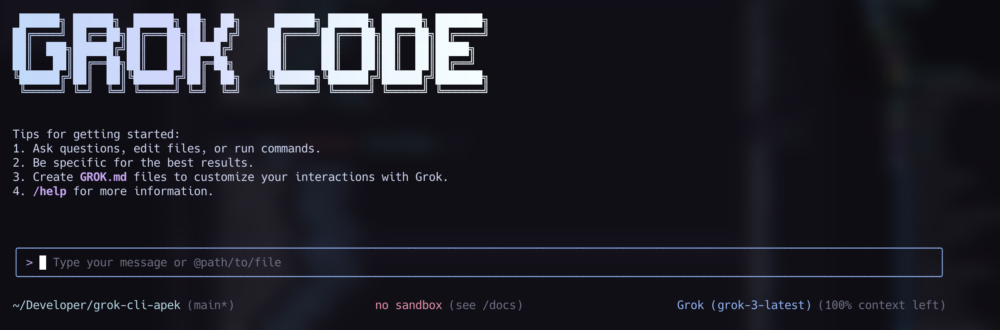

# Grok CLI

A command-line AI workflow tool powered by xAI's Grok that connects to your tools, understands your code, and accelerates your workflows.



With the Grok CLI you can:

- Query and edit large codebases with intelligent context management for Grok's token limits
- Generate new apps and solve complex coding problems using Grok's reasoning capabilities
- Automate operational tasks, like querying pull requests or handling complex rebases
- Use tools and MCP servers to connect new capabilities
- Smart file selection that adapts to Grok's context window for optimal performance

## Quickstart

1. **Prerequisites:** Ensure you have [Node.js version 18](https://nodejs.org/en/download) or higher installed.

2. **Install globally:**

   ```bash
   npm install -g @apekshik/grok-cli-apek
   ```

3. **Set up your xAI API Key:**

   Get your API key from [xAI Console](https://console.x.ai/) and set it as an environment variable:

   ```bash
   export XAI_API_KEY="your-api-key-here"
   ```

4. **Run the CLI:**

   ```bash
   grok
   ```

5. **Pick a color theme** and start chatting with Grok!

You are now ready to use the Grok CLI!

## Examples

Once the CLI is running, you can start interacting with Grok from your shell.

You can start a project from a new directory:

```sh
cd new-project/
grok
> Write me a Discord bot that answers questions using a FAQ.md file I will provide
```

Or work with an existing project:

```sh
git clone https://github.com/apekshik/grok-cli-apek
cd grok-cli-apek
grok
> Give me a summary of all of the changes that went in yesterday
```

## Provider Switching

The CLI supports both Grok and Gemini providers. You can switch between them during a conversation:

```bash
# Switch to Grok (default)
/provider grok

# Switch to Grok Mini for faster responses
/provider grok-mini

# Switch to Gemini (requires GEMINI_API_KEY)
/provider gemini
```

## Smart Context Management

The Grok CLI includes intelligent context management that automatically adapts to Grok's token limitations:

- **Automatic file selection**: When reading many files, it previews them and asks Grok to select the most relevant ones
- **Token-aware processing**: Tracks token usage and prevents API errors
- **Graceful fallbacks**: Multiple strategies to handle large codebases effectively

## Popular tasks

### Explore a new codebase

Start by `cd`ing into an existing or newly-cloned repository and running `grok`.

```text
> Describe the main pieces of this system's architecture.
```

```text
> What security mechanisms are in place?
```

### Work with your existing code

```text
> Implement a first draft for GitHub issue #123.
```

```text
> Help me migrate this codebase to the latest version of Node.js. Start with a plan.
```

### Automate your workflows

```text
> Convert all the images in this directory to png, and rename them to use dates from the exif data.
```

```text
> Organize my PDF invoices by month of expenditure.
```

## Authentication

### xAI API Key (Recommended)

1. Sign up at [xAI Console](https://console.x.ai/)
2. Generate an API key
3. Set it as an environment variable:

   ```bash
   export XAI_API_KEY="your-api-key-here"
   ```

### Alternative: Gemini API Key

You can also use Google's Gemini API by setting:

```bash
export GEMINI_API_KEY="your-gemini-api-key"
```

Get your Gemini API key from [Google AI Studio](https://aistudio.google.com/apikey).

## CLI Commands

Available slash commands:

- `/help` - Show help information
- `/provider <provider>` - Switch between grok, grok-mini, and gemini
- `/clear` - Clear conversation history
- `/theme` - Change color theme
- `/memory` - Show current context files
- `/tools` - List available tools

## Features

- **Context Files**: Create `GROK.md` files to provide persistent context
- **File Operations**: Read, edit, and write files with confirmation
- **Shell Integration**: Run shell commands with `!command`
- **Web Search**: Built-in web search capabilities
- **MCP Support**: Model Context Protocol for extensible tools

## Installation from Source

```bash
git clone https://github.com/apekshik/grok-cli-apek
cd grok-cli-apek
npm install
npm run build
npm run bundle
npm link
```

## Troubleshooting

### Common Issues

1. **API Key Issues**: Make sure `XAI_API_KEY` is set correctly
2. **Token Limits**: The CLI automatically handles Grok's context limits with smart selection
3. **Node.js Version**: Ensure you're using Node.js 18 or higher

### Debug Mode

Run with debug mode for detailed logging:

```bash
grok --debug
```

## Contributing

Contributions are welcome! Please see [CONTRIBUTING.md](./CONTRIBUTING.md) for guidelines.

## License

Apache-2.0 License - see [LICENSE](./LICENSE) for details.